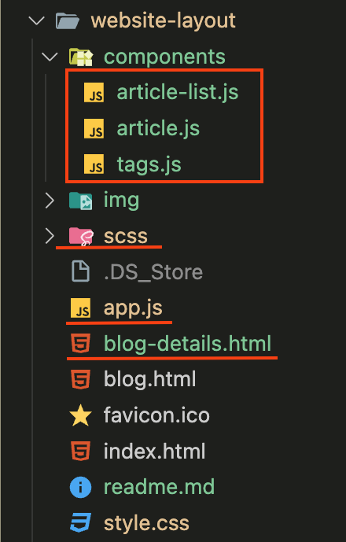

# Урок 6. Семинар: Компоненты

## Решение

См. репозиторий макета [gb-finally_project](https://github.com/lex0819/gb-finally_project/tree/main/website-layout)

См. страницу на тестовом хостинге [blog-details.html](https://geekbrains.elenivan.ru/blog-details.html)

### Архитектура компонентов

В файле blog-details.html подключаются все js-компоненты и головной файл app.js.

Стили написаны в scss и разделены по секциям для дальнейшего удобства переноса внутрь своего компонента при работе с Vue-CLI.

## Работа с макетом

Продолжаем работу с макетом:

— Реализовать страницу Blog details (Домашнее задание 3).

На странице отображается подробное описание статьи, а под ней размещаются остальные статьи. Необходимо, чтобы на выборе Tags происходила сортировка статей по выбранному тегу. Тег можно выбрать только один.

Задание по работе с макетом направлено на подготовку проекта к итоговой аттестации.

Формат сдачи: ссылка на гитхаб.
